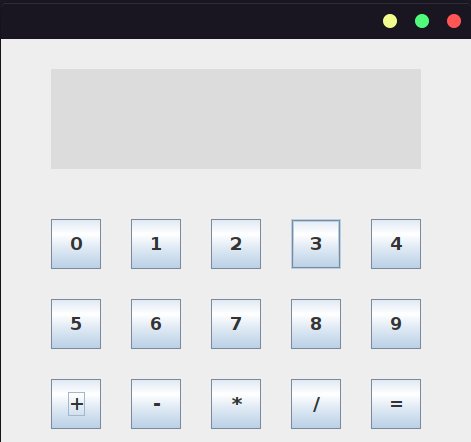
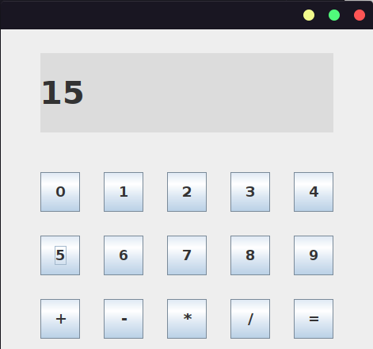
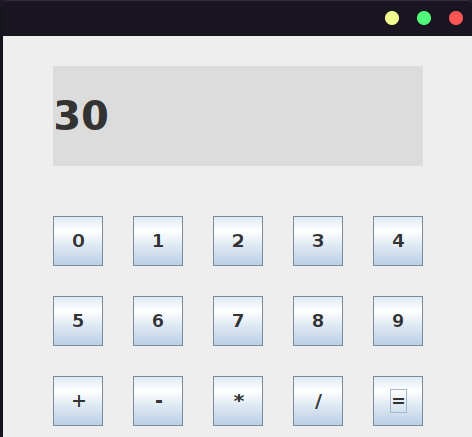

# CalculadoraUI

## Como funciona?

A calculadora funciona guardando o resultado do primeiro número digitado em uma variável, caso nada seja digitado essa variável vale 0, após digitar o primeiro número e clicar em +, ele adicionára o número na variável e limpará a tela da calculadora, caso queira fazer outra operação matemática, digite seu número faça a operação entre o número digitado e a variável que guarda o resultado da calculadora, para zerar o valor dessa variável clique no igual e depois no menos.

## Tela inicial
  

### Como somar?
  1. Digite o primeiro número  
      
  
  2. Clique em somar (a tela ficará zerada)  
      
  
  3. Digite o segundo número e depois clique em somar novamente  
      
  
  4. por último clique no igual   
      
